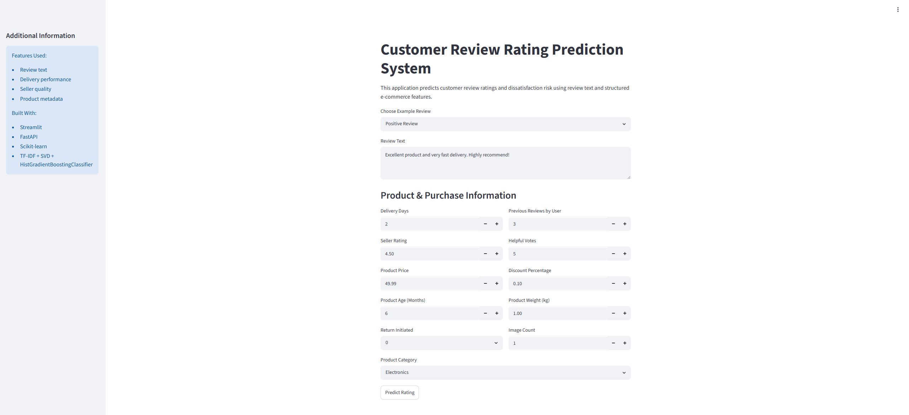
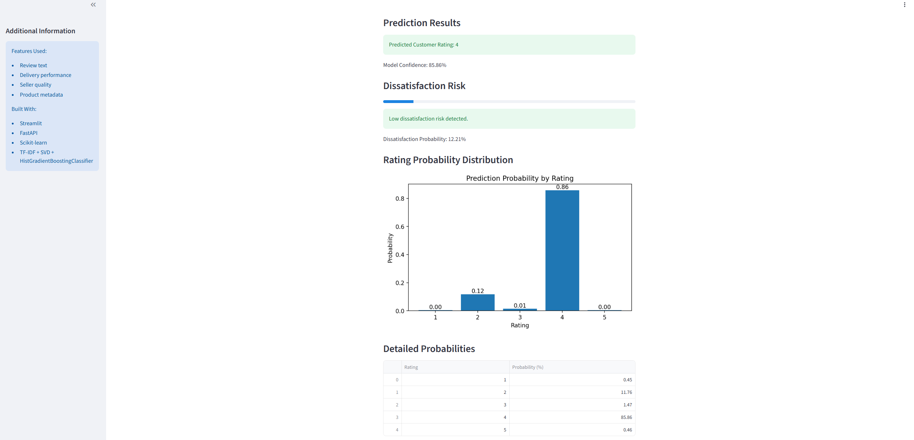

# Customer Review Rating Prediction System
## Overview
This project is a production-style end-to-end Machine Learning system that predicts customer review ratings (1–5 stars) and identifies dissatisfied customers using both NLP-based text analysis and structured e-commerce features.
The system is designed with a modular, service-oriented architecture that separates:

* Data processing
* Model training
* Inference serving
* Frontend interaction
* Deployment & CI/CD

It demonstrates a complete ML engineering lifecycle: from raw data → trained model → deployed API → interactive UI.


## Disclaimer 
Originally, this project was developed as part of a graduate-level Machine Learning course final group project. I later extended and enhanced into a production-style machine learning application.
Predictions are probabilistic and intended for demonstration purposes only.

## My Contributions

Following the original graduate ML project, I independently:

* Refactored notebook experiments into a modular codebase
* Built a FastAPI inference service
* Developed a Streamlit application
* Implemented Docker containerization
* Added automated testing
* Configured GitHub Actions CI
* Deployed frontend and backend on Railway
* Added threshold calibration and production-oriented evaluation
  
## Key Features 

* Natural language processing of customer reviews
* Multi-class rating prediction (ratings 1–5)
* Dissatisfaction risk scoring (ratings 1–2)
* Probability distribution visualization
* Real-time inference API (FastAPI)
* Interactive UI (Streamlit)
* Containerized deployment (Docker-ready)
* Reproducible ML pipeline
* Automated testing (pytest + CI/CD)
* Basic model logging for monitoring
* Full-stack deployment using Railway (FastAPI backend + Streamlit frontend)

## Live Demo
### Streamlit App (UI):

https://e-commerce-review-prediction-system.up.railway.app/

### How to Use:

1. Open Streamlit UI link
2. Enter review details
3. Click "Predict Rating"
4. View prediction and probability breakdown

### Application Screenshots 
#### Input Interface



#### Prediction Results



### FastAPI backend link (API):

https://backend-e-commerce-review-prediction-system.up.railway.app/docs

## Problem Statement

E-commerce platforms often struggle to:
* Detect dissatisfied customers early
* Extract sentiment from unstructured review text
* Combine structured and unstructured data effectively

### Objectives:
* Predict customer rating (1–5 stars)
* Identify dissatisfied customers (ratings 1–2)
* Provide probability distribution over all classes
* Enable real-time inference via API


## Machine Learning Approach

### Feature Engineering
* Text: TF-IDF + TruncatedSVD for semantic compression
* Numerical: StandardScaler with median imputation
* Categorical: OneHotEncoding with missing-value handling

### Model
* HistGradientBoostingClassifier (final production model)
* Optimized for structured and sparse text features
* Handles non-linear interactions efficiently

### Training Strategy
* RandomizedSearchCV for hyperparameter tuning
* 5-fold cross-validation
* Joint optimization of feature representation and model parameters

### Evaluation
* Weighted F1-score used as primary metric due to class imbalance
* Additional business metric: dissatisfied customer detection (high recall priority)
  

## System Architecture

The system is split into four layers: Streamlit frontend, FastAPI service, scikit-learn inference pipeline, and deployment infrastructure.


#### Clients
Users interact with the system through the Streamlit interface by:

* Entering review text and product details
* Viewing predicted ratings
* Viewing dissatisfaction risk probabilities
* Viewing probability distributions

#### Frontend (Streamlit)

The Streamlit frontend provides:

* Interactive prediction interface
* Probability visualization
* Real-time communication with the backend API

#### Backend API (FastAPI)

The FastAPI backend handles:

* Request validation using Pydantic
* Data preprocessing and validation
* Feature engineering pipeline execution
* Model inference
* JSON response generation

#### ML Pipeline

The machine learning pipeline includes:

* TF-IDF vectorization
* TruncatedSVD dimensionality reduction
* Structured feature preprocessing
* HistGradientBoostingClassifier inference


#### Model & Artifacts

Saved artifacts include:

* Trained model (`model.pkl`)
* TF-IDF vectorizer
* TruncatedSVD transformer
* ColumnTransformer preprocessing pipeline
* Encoders and scalers

#### Outputs

The system produces:

* Predicted rating (1–5)
* Dissatisfaction probability score
* Full probability distribution
* Confidence score

#### Infrastructure & DevOps

The project includes:

* Docker containerization
* GitHub Actions CI/CD
* Automated testing with pytest
* Railway deployment

## System Execution Flow

* User submits review via Streamlit UI
* Request is sent to FastAPI backend
* Pydantic validates input schema
* Pre-trained ML pipeline processes features and generates predictions
* API returns rating, probabilities, and dissatisfaction score
* Streamlit visualizes results in real time

## Project Structure

The project follows a modular structure separating application logic, ML components, experiments, and deployment configuration.
```
.github/              # CI workflows (GitHub Actions)

app/                  # FastAPI backend application

data/                 # Raw and processed datasets

images/               # README images and architecture diagram

logs/                 # Runtime logs (predictions)

models/               # Trained ML models and artifacts

notebooks/            # Exploratory data analysis and experiments

reports/              # Evaluation reports and model results

tests/                # Unit and integration tests (pytest)

Dockerfile            # Containerization configuration

Procfile              # Deployment configuration (Railway)

requirements.txt      # Python dependencies

streamlit_app.py      # Frontend UI (Streamlit)

README.md             # Project documentation

.gitignore            # Ignored files for Git

.dockerignore         # Ignored files for Docker builds

```

## Tech Stack

### Machine Learning

* Scikit-learn
* TF-IDF and TruncatedSVD
* HistGradientBoostingClassifier

### Backend

* FastAPI
* Pydantic

### Frontend

* Streamlit

### DevOps

* Docker (containerized)
* GitHub Actions (CI)

### Testing

* Pytest
* HTTPX (API testing)

## Running the Project Locally
1. Clone repository
   
`git clone https://github.com/SharipovaRi/ecommerce_review_prediction_system.git
`

`cd ecommerce_review_prediction_system
`

2. Install dependencies
   
`python -m pip install -r requirements.txt
`

3. Run FastAPI

`python -m uvicorn app.main:app --reload
`

4. Run Streamlit app

`python -m streamlit run streamlit_app.py
`

## Running Tests

`python -m pytest tests -v   
`
## CI Pipeline
This project uses GitHub Actions to:

* Install dependencies
* Run unit tests
* Validate API endpoints
* Ensure reproducibility

## Docker
The application is containerized to ensure reproducible environments across development and deployment.

`docker build -t review-model .
docker run -p 8000:8000 review-model
`

## Monitoring and Logging
The API includes logging to track prediction requests, model outputs and scores. 
Stored locally at: logs/predictions.log

## Dataset

The dataset contains ~2,000 e-commerce product reviews with:

* review_text (text)
* product_price
* seller_rating
* delivery_days
* product_category
* user engagement features (helpful votes, etc.)

Target:
* rating (1–5 stars)


## Model Performance

The final model (HistGradientBoostingClassifier with TF-IDF + SVD features) achieved:

### Overall Metrics
- Weighted F1: 0.61
- Macro F1: 0.60
- Accuracy: 0.61

### Business Objective (Dissatisfied Customers)
- Precision: 0.88
- Recall: 0.85
- Threshold: 0.40

## Model Comparison

Multiple models were evaluated using cross-validation on the combined feature set. 

| Model | Weighted F1 |
|---------|---------|
| Logistic Regression | 0.54 |
| HistGradientBoosting | 0.57 |
| Random Forest | 0.59 |
| Voting Ensemble | 0.60 |
| Tuned HistGradientBoosting | 0.61 |

## Final Model Selection

The Voting Ensemble achieved similar performance (~0.60 Weighted F1), but the tuned HistGradientBoostingClassifier was selected as the final model because:

* Comparable predictive performance
* Simpler deployment architecture
* Faster inference
* Easier hyperparameter optimization
* Lower operational complexity

IMPORTANT: All non-final models (including ensemble approaches) were used strictly for benchmarking and are not part of the production inference pipeline.

## Hyperparameter Tuning

RandomizedSearchCV was used to jointly optimize:

* TF-IDF representation
* TruncatedSVD dimensionality reduction
* HistGradientBoosting hyperparameters
Best configuration:

* TF-IDF max_features = 1000
* TF-IDF ngram_range = (1,1)
* TF-IDF min_df = 5
* SVD components = 200
* learning_rate = 0.1
* max_depth = 5
* max_leaf_nodes = 15

Best cross-validated Weighted F1:

**0.6055**

## Limitations

* Model performance decreases on very short reviews
* TF-IDF representation does not capture deep semantic meaning
* Dataset is relatively small (~2,000 samples)
* No real-time online learning implemented


